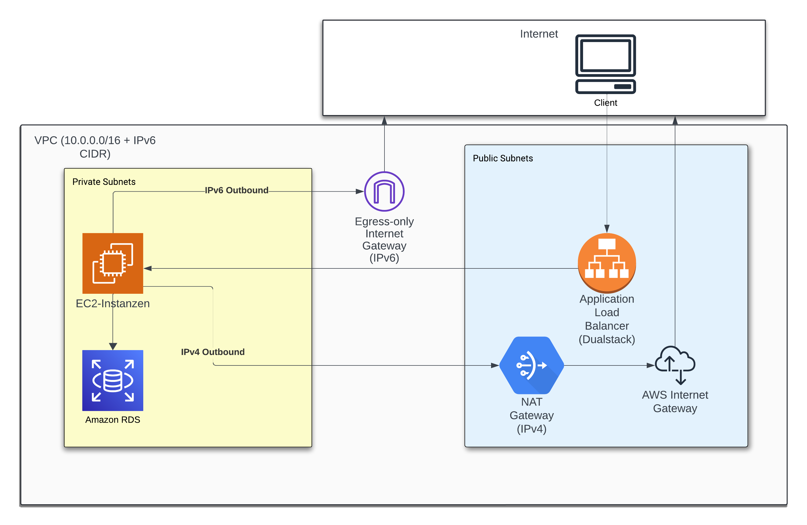

[](https://sonarcloud.io/summary/new_code?id=THBEdbloom_CCOProject)

# Inhaltsverzeichnis

1. [Projektübersicht](#projektübersicht)
2. [CI/CD](#cicd)
3. [Dockerfile](#dockerfile)
4. [Cloud-Architektur](#cloud-architektur)
    1. [Grundaufbau](#grundaufbau)
    2. [Absicherung](#absicherung)
        1. [NACL](#nacl)
        2. [Security Group Regeln](#security-group-regeln)
            - [Inbound Rules](#inbound-rules)
            - [Outbound Rules](#outbound-rules)
    3. [Instanzen](#instanzen)
    4. [Refresh der Instanzen bei Update](#refresh-der-instanzen-bei-update)
    5. [Datenhaltung](#datenhaltung)
    6. [Betrieb und Wartung](#betrieb-und-wartung)

# Projektübersicht
Unsere Aufgabe war es, eine AWS-basierte Infrastruktur mit mindestens drei AWS-Diensten zu entwickeln, einschließlich eines eigenen VPC mit öffentlichen und privaten Subnetzen sowie optionaler IPv6-Unterstützung. Es sollte dabei mit der deklaratives Programmiersprache Terraform verwenden. Es sollte ein Build Tool verwendet werden und es sollten zwei Testphasen mit je einem Beispieltest entwickelt werden, während der gesamte Entwicklungsprozess durch CI/CD-Pipelines automatisiert werden sollte. Weiterhin sollte durch statische Code-Analyse sowie Security Scanning mit GitHub/SonarCloud das Projekt überprüft werden.

Für die Bearbeitung der Aufgaben haben wir ein bestehendes Projekt aus dem vorherigen Semester als Grundlage genutzt. Das Projekt basiert auf dem Spring Boot Framework und wird mit Maven als Build-Management-Tool verwaltet. Neben den Grundkomponenten werden Thymeleaf als Template-Engine zur Darstellung der Daten sowie Spring Actuator zur Überwachung der Anwendung und Durchführung von Health Checks verwendet. Zur Verwaltung der Datenbankzugriffe kommt Spring JPA als Object-Relational-Mapping (ORM) Framework zum Einsatz. Ein S3-Bucket kommt dabei zur Nutzung durch eine Hochlade-Funktion und das Bereitstellen dieser Videos.

# CI/CD
Die CI/CD-Pipeline wird bei jedem Push oder Pull Request zum main-Branch ausgelöst. Zuerst wird ein MySQL-Docker-Container gestartet, um die benötigte Datenbank bereitzustellen, und es wird sichergestellt, dass MySQL betriebsbereit ist. Danach wird der Code mit der actions/checkout-Aktion aus dem Repository geladen, und JDK 17 wird eingerichtet, um die Java-Anwendung zu bauen.

Im nächsten Schritt erfolgt eine Analyse des Codes mit PMD, das potenzielle Codestil-Probleme und Fehler aufdeckt. Die generierten Berichte werden als Artefakte gespeichert. Anschließend wird der Code mit SonarCloud überprüft, um die Codequalität und Sicherheitslücken zu analysieren.

Abschließend wird ein Docker-Image der Anwendung gebaut und auf Docker Hub gepusht. Die Authentifizierung für Docker Hub erfolgt sicher über GitHub Secrets. Die Pipeline stellt somit sicher, dass der Code vor der Bereitstellung gründlich getestet und überprüft wird und ein funktionsfähiges Docker-Image erzeugt wird.

# Dockerfile
Im Dockerfile wird ein Docker-Image für eine Java-Anwendung basierend auf der neuesten Version von Ubuntu erstellt. Zunächst wird das Basis-Image ubuntu:latest verwendet, um eine minimalistische Linux-Umgebung bereitzustellen. Anschließend wird ein Label hinzugefügt, um den Maintainer des Dockerfiles anzugeben. Im nächsten Schritt werden mit apt-get die benötigten Pakete installiert, darunter Java 17 (JRE ohne grafische Oberfläche) und curl, um HTTP-Anfragen durchführen zu können. Zudem wird Maven installiert, ein Build-Tool, das in Java-Projekten häufig verwendet wird. Danach wird die lokale JAR-Datei der Anwendung (videothek-0.0.1-SNAPSHOT.jar) aus dem target-Verzeichnis in das Docker-Image kopiert und als /service.jar abgelegt. Der Port 8080 wird freigegeben, da die Anwendung auf diesem Port läuft. Zum Schluss wird der Einstiegspunkt des Containers so festgelegt, dass beim Starten des Containers automatisch die JAR-Datei mit dem Befehl java -jar /service.jar ausgeführt wird. Insgesamt sorgt dieses Dockerfile dafür, dass eine vollständig konzipierte und funktionierende Java-Anwendung in einem Docker-Container läuft.

# Cloud-Architektur
## Grundaufbau
Dieses Infrastrukturprojekt implementiert eine AWS-Architektur mit Dual-Stack-Unterstützung (IPv4/IPv6) für eine Video-Streaming-Anwendung. Die gesamte Infrastruktur wird mittels Infrastructure as Code (IaC) unter Verwendung von Terraform verwaltet. Dazu ist die Struktur in der folgenden Abbildung dargestellt.




Wie in der Abbildung zu sehen, basiert die Netzwerkinfrastruktur auf einer VPC-Konfiguration mit einem CIDR-Block von 10.0.0.0/16, die eine Dual-Stack-Konfiguration mit IPv6-Unterstützung umfasst. Die implementierte Konfiguration ermöglichen ebenfalls DNS-Hostnamen und DNS-Auflösung. Das Subnet-Layout besteht aus zwei öffentlichen Subnetzen (10.0.1.0/24, 10.0.2.0/24) und zwei privaten Subnetzen (10.0.10.0/24, 10.0.11.0/24), die alle IPv6-fähig sind und über automatische Adresszuweisung verfügen. Für die Internetverbindung wird ein Internet Gateway für öffentliche Subnetze, ein NAT Gateway für IPv4-Ausgang aus privaten Subnetzen und ein Egress-only Internet Gateway für IPv6-Ausgang aus privaten Subnetzen genutzt.

Die Anwendungsinfrastruktur basiert auf einem Application Load Balancer, der mit Dual-Stack-Funktionalität und einem HTTP-Listener auf Port 80 konfiguriert ist. Er führt regelmäßige Health-Checks auf dem von dem Spring Boot vorgegeben Acutator Endpoint durch. Es wird eine Target Tracking Policies verwendet. Eine wird für die durchschnittliche CPU-Auslastung mit einem Zielwert von 70%. Die Skalierung erfolgt dabei in privaten Subnetzen unter Verwendung eines Launch Templates, das eine t2.nano Instanz mit einer benutzerdefinierten AMI spezifiziert. Als Basis für Autoscaling wurde festgelegt, dass zwei Instanzen zu normalen Zeiten laufen, falls eine Instanz ausfallen sollte

## Absicherung
### NACL
Die erste Absicherung des Cloud-Netzwerkes sind Netzwerk-Zugriffskontrolllisten (NACLs), wobei die öffentlichen Subnetze den eingehenden HTTP-Verkehr (Port 80) und die Ephemeral Ports (1024-65535) erlauben. Ausgehend wird der gesamte Verkehr erlaubt. Die NACLs für private Subnetze erlauben eingehenden Verkehr auf dem Anwendungsport (8080) von ALB-Subnetzen und ausgehend den gesamten Verkehr wie auch RDS-Zugriff.
### Security Group Regeln

Zusätzlich haben wurden verschiedene Sicherheitsgruppen implementiert. Die Application Load Balancer (ALB)-Sicherheitsgruppe, erlaubt HTTP-Verkehr von überall, da der Client mit dem Server kommunizieren muss. Dies geschieht über Port 80. Die Backend-Sicherheitsgruppe beschränkt den eingehenden Verkehr auf Port 8080 vom ALB. Dies hat den Grund, dass der Spring Boot Server auf Port 8080 hört und der ALB mit dieser Applikation kommunizieren muss. Die Datenbank-Sicherheitsgruppe lässt nur MySQL-Verbindungen (Port 3306) von Backend-Instanzen zu. Die Daten werden von dem Spring Boot Server benötigt. Genaue diese Regelungen lassen sich in der Tabelle erkennen.

#### Inbound Rules

| Group    | Type     | Port | Source/Dest    | Description         |
|----------|----------|------|----------------|---------------------|
| ALB      | IPv4/v6  | 80   | 0.0.0.0/0, ::/0 | HTTP zum Internet |
| Backend  | TCP      | 8080 | alb-sg         | Verkehr vom ALB    |
| Database | TCP      | 3306 | backend-sg     | MySQL Verbindung Backend  |

#### Outbound Rules

| Group    | Type     | Port | Source/Dest    | Description         |
|----------|----------|------|----------------|---------------------|
| ALB      | IPv4/v6  | ALL  | 0.0.0.0/0, ::/0 | Ausgehender Verkehr |
| Backend  | IPv4/v6  | ALL  | 0.0.0.0/0, ::/0 | Ausgehender Verkehr |
| Database | -        | -    | -              | Kein usgehender Verkehr   |

## Instanzen

Die Wahl fiel auf den Instanztyp t2.micro, da die Anforderungen der Website sehr gering sind und das horizontal Scaling dies ausgleichen sollte. Zur Ermittlung der minimalen Ressourcenanforderungen wurde ein Python-Skript geschrieben, mit dem die Anwendung auf Erreichbarkeit getestet wurde. Ausgehend von einer t2.small Instanz wurde die Größe schrittweise über t2.micro auf t2.nano reduziert, um die kleinstmögliche, aber noch funktionsfähige Instanzgröße zu bestimmen. Die t2.nano-Instanz ist bei dem Testen abgestürzt, aber die t2.micro-Instanz war weiter funktionsfähig. Es könnte genauso auch t2.small verwendet werden, obwohl der Preis doppelt zu hoch ist, ist dieser immer noch niedrig. Bei 2 Instanzen wären dies ca. 30 Euro im Monat im Gegensatz zu den 15 Euro für die kleineren t2.micro-Instanzen.

Die EC2-Infrastruktur verwendet eine Launch Template als Basis für die Instanzkonfiguration.  Zur Fehleranalyse wurde ein ssh-Zugriff über ein in dem Skript definiertes Key-Pair eingerichtet. Jede Instanz ist dem privaten Subnetz zugewiesen, wobei diese keine öffentlichen IPv4-Adressen besitzen, damit diese nicht direkt angesprochen werden können. Die Instanzen erhalten eine IPv6-Adresse, deren ausgehender Verkehr über ein Egress-only Internet Gateway geleitet wird. Diese werden nur genutzt, falls eine Fehleranalyse durchgeführt werden muss.

Für die Instanzinitialisierung werden Nutzerdaten in einem separaten script.tpl hinterlegt und Base64-kodiert eingebunden. Alternative Lösungsansätze wie ECS-Instanzen wurden betrachtet, konnten jedoch aufgrund fehlender IAM-Rollen nicht umgesetzt werden.

## Refresh der Instanzen bei Update
Damit Instanzen kontinuierlich aktualisiert werden können, wurde ein Versionierungsmechanismus mittels Zeitstempeln implementiert. Bei jeder Ausführung werden sowohl die Instanzbeschreibung als auch das Versions-Tag des Auto-Scalers aktualisiert. Diese Methodik ermöglicht eine Integration in die CI/CD-Pipeline, wodurch EC2-Instanzen durch Terraform apply-Befehle automatisiert aktualisiert werden können.

## Datenhaltung
Für die Datenhaltung wurde ein S3-Bucket mit einem dynamisch generierten Namen (Präfix "backend-uploads-") eingerichtet, der standardmäßig AES-256 Verschlüsselung für alle gespeicherten Objekte verwendet. Durch die Konfiguration des Public Access Blocks wird jeglicher öffentlicher Zugriff auf den Bucket verhindert, indem sowohl öffentliche ACLs als auch öffentliche Bucket-Policies blockiert werden. Der Bucket ist mit der Option "force_destroy = true" konfiguriert, was bedeutet, dass alle Objekte im Bucket automatisch gelöscht werden können, wenn der Bucket über Terraform zerstört wird. Der Nutzer der den Bucket erstellt hat somit als einziger Read/Write-Rechte. Um kurzzeitigen Zugriff auf bestimmte Ressourcen zu gewähren, können Presigned-URLs verwendet werden. Es konnte aufgrund fehlender Rechte kein CloudFront eingesetzt werden.

Für die Datenpersistenz wird eine RDS MySQL 8.0 Instanz der Klasse db.t4g.micro genutzt, welche mit 20GB GP3 Speicher ausgestattet und in privaten Subnetzen platziert ist.
## Betrieb und Wartung
Für Wartung und Betrieb hwurden Rolling Updates, Health Checks und Versionsverfolgung implementiert.

Die Überwachung erfolgt über ALB-Metriken, EC2-Instanz CPU-Auslastung, Auto Scaling Events, Health-Checks und Datenbank-Performance-Metriken. Die Implementierung nutzt die AWS-Dienste VPC, EC2 mit Auto Scaling, RDS und Elastic Load Balancing. Für das Deployment werden AWS-Zugangsdaten und Terraform benötigt.

Zukünftige Verbesserungen könnten SSL/TLS-Integration, erweiterte Überwachung, Backup-Strategien und Kostenoptimierung umfassen. Die Infrastruktur-Konfiguration wurde durch Verwendung von Variablen gestaltet, indem die Einstellungen in variables.tf und deklariert und deren Werte in variables.auto.tfvars definiert werden. Secrets, wie das Datenbankpasswort wurden in secrets.tf und secrets.auto.tfvars hinterlegt.


# Ausführung

## Terraform-Skript

Die Voraussetzung, um das Terraform-Skript ausführen zu können ist es notwendig die Credentials für AWS in secrets.auto.tfvars zu setzten mit ```aws_access_key```, ```aws_secret_key```, ```aws_session_token```. Dies hat den Grund, dass keine IAM-Regeln erstellt werden können und die Variablen für die EC2-Instanzen bekannt sein müssen. Die Datei dazu ist noch nicht angelegt und sollte dann lokal im Terraform-Ordner gespeichert werden.
Um das Terraform Skript auszuführen muss folgendes in Reihenfolge durchgeführt werden:

1. ```secrets.auto.tfvars```-Datei anlegen mit Datenbanknamen ```db_username``` und Passwort ```db_password```
2. terraform init
3. terraform apply 


